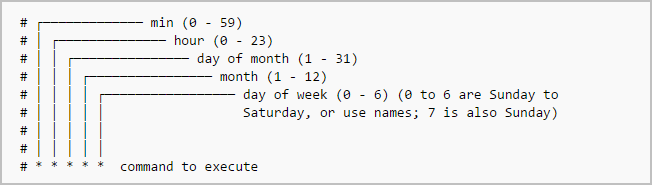

# Cron README

# Crontab Formatting

Minute(0-59) Hour(0-24) Day_of_month(1-31) Month(1-12) Day_of_week(0-6) Command_to_execute

# Cron.d formatting

Minute(0-59) Hour(0-24) Day_of_month(1-31) Month(1-12) Day_of_week(0-6) <User> Command_to_execute



# Commands

```bash
#For more details, check man pages.
man crontab
#To display the contents of the crontab file of the currently logged in user:
crontab -l

#To edit the current user’s cron jobs, do:
crontab -e

#To edit the crontab of a different user, for example <username>, do:
crontab -u <username> -e

#To run a cron job at every minute, the format should be like below.
#Check time format
* * * * * <command-to-execute>

#To remove all cron jobs for the current user:
crontab -r
```

# String formatting

We can also use the following strings to define job.
@reboot	Run once, at startup.
@yearly	Run once a year.
@annually	(same as @yearly).
@monthly	Run once a month.
@weekly	Run once a week.
@daily	Run once a day.
@midnight	(same as @daily).
@hourly	Run once an hour.

# Generating Cron commands

-   <https://crontab.guru/>
-   <https://crontab-generator.org/>

# On Linux:

```bash
service crond status
service crond stop
service crond start
```

Cron Output: `grep cron /var/log/syslog`

Show Error: `tail -f /var/log/syslog | grep --line-buffered cron`

Show that cron is running: `pgrep cron`  - If you see no number, then cron is not running.

Check cron log: `tail -f /var/log/cron.log`

# Crontab -e vs /etc/cron.d

The differences are documented in detail in the cron(8) manpage in Debian. The main difference is that `/etc/cron.d` is populated with separate files, whereas
crontab manages one file per user; it’s thus easier to manage the contents of /etc/cron.d using scripts (for automated installation and updates), and
easier to manage crontab using an editor (for end users really).

Other important differences are that not all distributions support /etc/cron.d,
and that the files in /etc/cron.d have to meet a certain number of requirements (beyond being valid cron jobs):
they must be owned by root, and must conform to run-parts’ naming conventions (no dots, only letters, digits, underscores, and hyphens).

If you’re considering using `/etc/cron.d`, it’s usually worth considering one of `/etc/cron.hourly`, `/etc/cron.daily`, `/etc/cron.weekly`, or `/etc/cron.monthly` instead.

# Gotchas

-   Different environment

Cron passes a minimal set of environment variables to your jobs. To see the difference, add a dummy job like this:

```bash
* * * * * env > /tmp/env.output
```

-   If you forget to add a newline at the end of the crontab file. In other words, the crontab file should end with an empty line.

```bash
man crontab

#Although cron requires that each entry in a crontab end  in  a  newline
#   character,  neither the crontab command nor the cron daemon will detect
#   this error. Instead, the crontab will appear to load normally. However,
#   the  command  will  never  run.  The best choice is to ensure that your
#   crontab has a blank line at the end.
#
#   4th Berkeley Distribution      29 December 1993               CRONTAB(1)
```

-   The script filenames in `cron.d/, cron.daily/, cron.hourly/`, etc., should not contain dot (.), otherwise run-parts will skip them.
    It's a feature not a bug - it keeps things like myscript.backup or myscript.original or myscript.rpm-new from running right beside myscript


-   Cron jobs uses `sh`
    In many environments cron executes commands using sh, while many people assume it will use bash.
    Suggestions to test or fix this for a failing command:
    Try running the command in sh to see if it works:
    `sh -c "mycommand"`
    Wrap the command in a bash subshell to make sure it gets run in bash:
    `bash -c "mybashcommand"`
    Tell cron to run all commands in bash by setting the shell at the top of your crontab:
    `SHELL=/bin/bash`
    If the command is a script, make sure the script contains a shebang:
    `#!/bin/bash`

-   Absolute path should be used for scripts:
    `/bin/grep` should be used instead of `grep`

-   If your crontab command has a % symbol in it, cron tries to interpret it.
    So if you were using any command with a % in it (such as a format specification to the date command) you will need to escape it.

-   Cron is calling a script which is not executable.
    By running `chmod +x /path/to/script` the script becomes executable and should resolve this issue.

-   If your cronjob invokes GUI-apps, you need to tell them what `DISPLAY` they should use.
    Example: Firefox launch with cron.
    Your script should contain `export DISPLAY=:0` somewhere.
    `* * * * * export DISPLAY=:0 && <command>`

# References

-   <http://www.pantz.org/software/cron/croninfo.html>
-   <https://unix.stackexchange.com/questions/417323/what-is-the-difference-between-cron-d-as-in-etc-cron-d-and-crontab>
-   <https://www.ostechnix.com/a-beginners-guide-to-cron-jobs/>
-   <https://askubuntu.com/questions/85558/verify-if-crontab-works>
-   <https://serverfault.com/questions/840398/cron-error-getpwnam-failed-for-db-back-up>
-   <https://askubuntu.com/questions/23009/why-crontab-scripts-are-not-working>
- https://help.ubuntu.com/community/CronHowto
